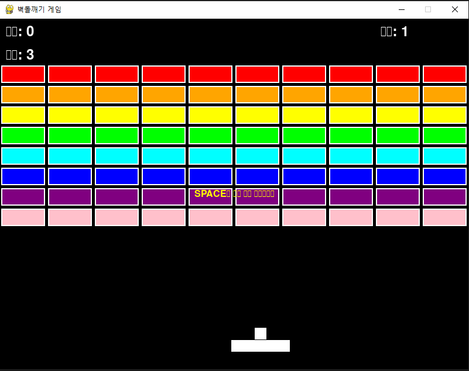

# 🎮 PyGame 벽돌깨기 (Breakout Game)

클래식한 벽돌깨기 게임을 Python의 PyGame 라이브러리로 구현한 프로젝트입니다.


## 📋 목차
- [게임 소개](#-게임-소개)
- [주요 기능](#-주요-기능)
- [설치 방법](#-설치-방법)
- [실행 방법](#-실행-방법)
- [조작법](#-조작법)
- [게임 규칙](#-게임-규칙)
- [파워업 시스템](#-파워업-시스템)
- [스크린샷](#-스크린샷)
- [기술적 특징](#-기술적-특징)
- [파일 구조](#-파일-구조)
- [개발 환경](#-개발-환경)
- [향후 계획](#-향후-계획)
- [기여하기](#-기여하기)
- [라이선스](#-라이선스)

## 🎯 게임 소개

벽돌깨기(Breakout)는 1976년 아타리에서 처음 출시된 클래식 아케이드 게임입니다. 이 프로젝트는 현대적인 Python과 PyGame을 사용하여 원작의 재미를 그대로 살리면서도 새로운 기능들을 추가한 리메이크 버전입니다.

플레이어는 패들을 조작하여 공을 튕겨서 화면 위쪽의 벽돌들을 모두 파괴하는 것이 목표입니다.

## ✨ 주요 기능

### 🎮 핵심 게임플레이
- **80개의 다채로운 벽돌** (8행 × 10열)
- **스마트한 공 물리학** - 패들의 어느 부분에 맞았는지에 따라 반사각 조절
- **점수 시스템** - 위쪽 벽돌일수록 높은 점수 (10~80점)
- **생명 시스템** - 3개의 생명으로 시작

### 🎁 파워업 시스템
벽돌 파괴 시 20% 확률로 파워업 아이템이 등장합니다:

- **🟢 E (Expand)**: 패들 크기 1.5배 확장
- **🟡 M (Multi-ball)**: 추가 공 2개 생성
- **🔴 ♥ (Extra Life)**: 생명 1개 추가

### 🎨 사용자 인터페이스
- **메뉴 화면**: 게임 시작 및 조작법 안내
- **실시간 정보**: 점수, 생명, 레벨 표시
- **게임 오버/승리 화면**: 최종 점수 및 재시작 옵션
- **직관적인 조작**: 마우스 또는 키보드 지원

## 🔧 설치 방법

### 시스템 요구사항
- Python 3.8 이상
- PyGame 2.0 이상

### 설치 단계

1. **저장소 클론**
   ```bash
   git clone https://github.com/yourusername/breakout-game.git
   cd breakout-game
   ```

2. **PyGame 설치**
   ```bash
   pip install pygame
   ```

3. **설치 확인**
   ```bash
   python -c "import pygame; print(f'PyGame 버전: {pygame.version.ver}')"
   ```

## 🚀 실행 방법

```bash
python breakout_game.py
```

또는 Python 실행 환경에서:
```python
python3 breakout_game.py
```

## 🎮 조작법

### 키보드 조작
- **← →** : 패들 좌우 이동
- **Space** : 공 발사 (게임 시작 시 & 새 공 생성 시)
- **R** : 게임 재시작 (게임 오버/승리 시)

### 마우스 조작
- **마우스 이동** : 패들을 마우스 X좌표로 이동
- **마우스 + Space** : 정밀한 조작 가능

## 📖 게임 규칙

### 기본 규칙
1. **목표**: 모든 벽돌을 파괴하여 승리
2. **패배 조건**: 모든 생명을 잃으면 게임 오버
3. **생명 손실**: 공이 화면 아래로 떨어지면 생명 1개 감소

### 점수 시스템
- **1행 (분홍색)**: 80점
- **2행 (보라색)**: 70점
- **3행 (파란색)**: 60점
- **4행 (청록색)**: 50점
- **5행 (초록색)**: 40점
- **6행 (노란색)**: 30점
- **7행 (주황색)**: 20점
- **8행 (빨간색)**: 10점

### 물리학 시스템
- 공이 패들의 중앙에 맞으면 수직으로 반사
- 패들의 가장자리에 맞으면 최대 60도까지 각도 조절
- 벽면 충돌 시 정확한 반사각으로 튕김

## 🎁 파워업 시스템

| 아이콘 | 이름 | 효과 | 지속시간 |
|--------|------|------|----------|
| 🟢 E | Expand Paddle | 패들 크기 1.5배 확장 | 일시적 |
| 🟡 M | Multi Ball | 추가 공 2개 생성 | 영구적 |
| 🔴 ♥ | Extra Life | 생명 1개 추가 | 영구적 |

## 📸 스크린샷

```
게임 화면 예시:
┌─────────────────────────────────────────────────────────────┐
│ 점수: 450        🧱🧱🧱🧱🧱🧱🧱🧱🧱🧱        레벨: 1 │
│ 생명: 2          🧱🧱🧱🧱🧱🧱🧱🧱🧱🧱                  │
│                  🧱🧱🧱🧱🧱🧱🧱🧱🧱🧱                  │
│                  🧱🧱🧱🧱🧱🧱🧱🧱🧱🧱                  │
│                                                             │
│                            ⚪                               │
│                                                             │
│                                                             │
│                                                             │
│                         ▬▬▬▬▬                              │
└─────────────────────────────────────────────────────────────┘
```


## 🛠️ 기술적 특징

### 아키텍처
- **객체지향 프로그래밍**: 각 게임 요소를 독립적인 클래스로 구현
- **스프라이트 시스템**: PyGame의 Sprite 클래스 활용으로 효율적인 충돌 검사
- **상태 기계**: 메뉴, 플레이, 게임오버, 승리 상태 관리
- **이벤트 드리븐**: 키보드/마우스 입력을 이벤트로 처리

### 성능 최적화
- **스프라이트 그룹**: 일괄 업데이트 및 렌더링
- **충돌 검사 최적화**: PyGame 내장 함수 활용
- **메모리 관리**: 불필요한 객체 자동 제거
- **60FPS 고정**: 안정적인 게임 루프

### 코드 품질
- **모듈화**: 기능별로 메서드 분리
- **가독성**: 명확한 변수명과 주석
- **확장성**: 새로운 기능 추가 용이
- **유지보수성**: 설정값을 상수로 분리

## 📁 파일 구조

```
breakout-game/
│
├── breakout_game.py      # 메인 게임 파일
├── README.md            # 프로젝트 설명서
├── requirements.txt     # 의존성 목록
├── LICENSE             # 라이선스 정보
│
├── assets/             # 게임 리소스 (선택사항)
│   ├── images/         # 이미지 파일
│   ├── sounds/         # 사운드 파일
│   └── fonts/          # 폰트 파일
│
└── docs/               # 추가 문서
    ├── GAMEPLAY.md     # 게임플레이 가이드
    └── DEVELOPMENT.md  # 개발 가이드
```

## 🔧 개발 환경

### 개발 도구
- **IDE**: Visual Studio Code, PyCharm
- **버전 관리**: Git
- **패키지 관리**: pip
- **디버깅**: Python 내장 디버거

### 테스트 환경
- **OS**: Windows 10/11, macOS, Ubuntu 20.04+
- **Python**: 3.8, 3.9, 3.10, 3.11
- **PyGame**: 2.0.0+

## 🚧 향후 계획

### 단기 계획 (v1.1)
- [ ] 사운드 효과 추가 (벽돌 파괴, 패들 충돌 등)
- [ ] 배경 음악 시스템
- [ ] 레벨 시스템 (난이도 증가)
- [ ] 하이스코어 저장 기능

### 중기 계획 (v1.2)
- [ ] 다양한 벽돌 타입 (2회 타격, 파괴 불가능 등)
- [ ] 더 많은 파워업 종류
- [ ] 파티클 효과 시스템
- [ ] 설정 메뉴 (음량, 난이도 등)

### 장기 계획 (v2.0)
- [ ] 멀티플레이어 모드
- [ ] 레벨 에디터
- [ ] 성취 시스템
- [ ] 온라인 리더보드

## 🤝 기여하기

이 프로젝트에 기여하고 싶으시다면:

1. **Fork** 이 저장소
2. **Feature branch** 생성 (`git checkout -b feature/AmazingFeature`)
3. **변경사항 커밋** (`git commit -m 'Add some AmazingFeature'`)
4. **Branch에 Push** (`git push origin feature/AmazingFeature`)
5. **Pull Request** 생성

### 기여 가이드라인
- 코드 스타일: PEP 8 준수
- 커밋 메시지: 영어로 명확하게 작성
- 테스트: 새 기능 추가 시 테스트 케이스 포함
- 문서화: README 업데이트 필요 시 함께 수정

## 🐛 버그 리포트

버그를 발견하셨나요? [Issues](https://github.com/yourusername/breakout-game/issues)에서 다음 정보와 함께 리포트해주세요:

- 운영체제 및 버전
- Python 및 PyGame 버전
- 버그 재현 단계
- 예상 동작 vs 실제 동작
- 스크린샷 (가능한 경우)

## 📜 라이선스

이 프로젝트는 MIT 라이선스 하에 배포됩니다. 자세한 내용은 `LICENSE` 파일을 참조하세요.

```
MIT License

Copyright (c) 2025 [Your Name]

Permission is hereby granted, free of charge, to any person obtaining a copy
of this software and associated documentation files (the "Software"), to deal
in the Software without restriction, including without limitation the rights
to use, copy, modify, merge, publish, distribute, sublicense, and/or sell
copies of the Software, and to permit persons to whom the Software is
furnished to do so, subject to the following conditions:

The above copyright notice and this permission notice shall be included in all
copies or substantial portions of the Software.
```

## 🙋‍♂️ FAQ

**Q: 게임이 너무 빠르거나 느려요.**
A: `breakout_game.py` 파일의 `FPS` 상수값을 조절해보세요. 기본값은 60입니다.

**Q: 패들 크기를 조절하고 싶어요.**
A: `PADDLE_WIDTH` 상수값을 변경하면 됩니다.

**Q: 더 많은 벽돌을 원해요.**
A: `BRICK_ROWS`와 `BRICK_COLS` 상수값을 조절하세요.

**Q: 파워업 확률을 바꾸고 싶어요.**
A: `check_collisions()` 메서드의 `random.random() < 0.2` 부분에서 0.2를 원하는 확률로 변경하세요.

---

## 🌟 즐거운 게임 되세요!
