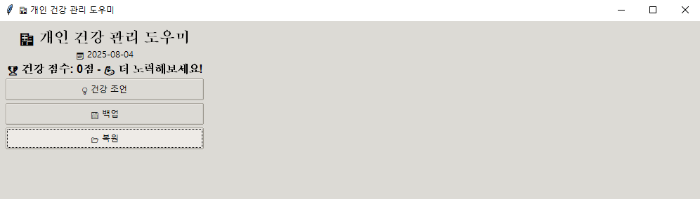

# 🏥 HealthTrackerGUI - 개인 건강 관리 도우미

이 프로그램은 **Tkinter GUI 기반의 개인 건강 관리 도우미**입니다.  
사용자가 매일 건강 데이터를 기록하고, 건강 점수를 계산하며, 간단한 건강 조언과 데이터 백업/복원 기능을 제공합니다.

---

## ✨ 기능
- **일일 건강 점수 계산**: 물 섭취, 걸음 수, 수면, 운동, 체중, 혈압 등 기록 기반 점수화  
- **건강 조언 제공**: 부족한 항목에 대한 맞춤형 피드백 표시  
- **데이터 관리**: JSON 파일 저장, 백업 및 복원 지원  
- **GUI 지원**: Tkinter 기반 직관적인 인터페이스  

---

## 🛠️ 설치 방법

1. **Python 3.x 설치**
   - [Python 공식 사이트](https://www.python.org/downloads/)에서 Python을 설치합니다.
   - 설치 시 **"Add Python to PATH"** 옵션을 체크하세요.

2. **필요한 라이브러리 설치**
   ```bash
   pip install matplotlib

## ▶️ 실행 방법
저장된 소스 코드를 health_tracker.py로 저장합니다.

터미널(또는 CMD)에서 실행:

```
python health_tracker.py
```
GUI 창이 열리면 건강 데이터를 기록하고 관리할 수 있습니다.

## 📂 코드
```
import json
import os
from datetime import datetime
import tkinter as tk
from tkinter import ttk, messagebox, simpledialog, filedialog
import matplotlib.pyplot as plt
from matplotlib.backends.backend_tkagg import FigureCanvasTkAgg
import platform

class HealthTrackerGUI:
    def __init__(self):
        self.data_file = "health_data.json"
        self.health_data = self.load_data()
        self.setup_korean_font()

        self.root = tk.Tk()
        self.root.title("🏥 개인 건강 관리 도우미")
        self.root.geometry("1000x700")
        self.root.resizable(True, True)

        self.style = ttk.Style()
        self.style.theme_use('clam')

        self.setup_gui()
        self.update_display()

    def setup_korean_font(self):
        if platform.system() == 'Windows':
            plt.rcParams['font.family'] = 'Malgun Gothic'
        elif platform.system() == 'Darwin':
            plt.rcParams['font.family'] = 'AppleGothic'
        else:
            plt.rcParams['font.family'] = 'DejaVu Sans'
        plt.rcParams['axes.unicode_minus'] = False

    def load_data(self):
        if os.path.exists(self.data_file):
            with open(self.data_file, 'r', encoding='utf-8') as f:
                return json.load(f)
        return {}

    def save_data(self):
        with open(self.data_file, 'w', encoding='utf-8') as f:
            json.dump(self.health_data, f, ensure_ascii=False, indent=2)

    def get_today_key(self):
        return datetime.now().strftime("%Y-%m-%d")

    def get_today_data(self, date_key=None):
        if date_key is None:
            date_key = self.get_today_key()
        default_data = {
            'water': 0, 'steps': 0, 'sleep': 0.0, 'weight': 0.0,
            'blood_pressure': {'systolic': 0, 'diastolic': 0},
            'mood': '', 'medications': [], 'symptoms': '',
            'notes': '', 'exercise_minutes': 0
        }
        return self.health_data.get(date_key, default_data.copy())

    def update_field(self, field, value, date_key=None):
        if date_key is None:
            date_key = self.get_today_key()
        if date_key not in self.health_data:
            self.health_data[date_key] = self.get_today_data()
        self.health_data[date_key][field] = value
        self.save_data()
        self.update_display()

    def calculate_health_score(self, date_key=None):
        data = self.get_today_data(date_key)
        score = 0
        score += min(data['water'] / 2000 * 20, 20)
        score += min(data['steps'] / 10000 * 20, 20)
        if 7 <= data['sleep'] <= 9: score += 20
        elif 6 <= data['sleep'] <= 10: score += 15
        elif data['sleep'] >= 5: score += 10
        score += min(data['exercise_minutes'] / 30 * 15, 15)
        if data['weight'] > 0: score += 5
        if data['blood_pressure']['systolic'] > 0: score += 5
        if data['mood']: score += 5
        if data['medications']: score += 5
        if data['notes']: score += 5
        return round(score)

    def setup_gui(self):
        main_frame = ttk.Frame(self.root, padding="10")
        main_frame.grid(row=0, column=0, sticky=(tk.W, tk.E, tk.N, tk.S))
        self.root.columnconfigure(0, weight=1)
        self.root.rowconfigure(0, weight=1)

        # --- 헤더 ---
        header_frame = ttk.Frame(main_frame)
        header_frame.grid(row=0, column=0, columnspan=2, pady=(0, 10))
        ttk.Label(header_frame, text="🏥 개인 건강 관리 도우미", font=('Arial', 16, 'bold')).pack()
        self.date_label = ttk.Label(header_frame, text=f"📅 {self.get_today_key()}")
        self.date_label.pack()
        self.score_label = ttk.Label(header_frame, text="", font=('Arial', 12, 'bold'))
        self.score_label.pack()

        # --- 버튼 ---
        self.setup_buttons(header_frame)

    def setup_buttons(self, parent):
        ttk.Button(parent, text="💡 건강 조언", command=self.show_health_advice).pack(fill=tk.X, pady=2)
        ttk.Button(parent, text="💾 백업", command=self.backup_data).pack(fill=tk.X, pady=2)
        ttk.Button(parent, text="📂 복원", command=self.restore_data).pack(fill=tk.X, pady=2)

    def show_health_advice(self):
        today_data = self.get_today_data()
        advice = []
        if today_data['water'] < 1500: advice.append("💧 물을 더 많이 마셔보세요.")
        if today_data['steps'] < 5000: advice.append("🚶‍♂️ 조금 더 걸어보세요.")
        if today_data['sleep'] < 6: advice.append("😴 충분히 주무세요.")
        if today_data['exercise_minutes'] < 30: advice.append("🏃‍♂️ 운동을 늘리세요.")
        if today_data['weight'] == 0: advice.append("⚖️ 체중을 기록하세요.")
        if not advice: advice.append("🎉 오늘 건강 관리가 좋습니다!")
        messagebox.showinfo("건강 조언", "\n".join(advice))

    def backup_data(self):
        filename = filedialog.asksaveasfilename(defaultextension=".json")
        if filename:
            with open(filename, 'w', encoding='utf-8') as f:
                json.dump(self.health_data, f, ensure_ascii=False, indent=2)
            messagebox.showinfo("백업 완료", f"{filename}에 저장되었습니다.")

    def restore_data(self):
        filename = filedialog.askopenfilename(filetypes=[("JSON 파일", "*.json")])
        if filename:
            with open(filename, 'r', encoding='utf-8') as f:
                self.health_data = json.load(f)
            self.save_data()
            self.update_display()
            messagebox.showinfo("복원 완료", "데이터가 복원되었습니다.")

    def update_display(self):
        self.update_score_display()

    def update_score_display(self):
        score = self.calculate_health_score()
        if score >= 80: msg = "🎉 훌륭합니다!"
        elif score >= 60: msg = "👍 좋습니다!"
        else: msg = "💪 더 노력해보세요!"
        self.score_label.config(text=f"🏆 건강 점수: {score}점 - {msg}")

if __name__ == "__main__":
    app = HealthTrackerGUI()
    app.root.mainloop()
```
## 🖼 실행 화면 예시
메인 화면	건강 조언 팝업


💡 실제 실행 화면 캡처 후 위 이미지 링크를 변경하세요. (GitHub에 images 폴더 추가 후 상대경로로 연결 권장)

## 📜 라이선스
이 프로젝트는 MIT 라이선스를 따릅니다.


